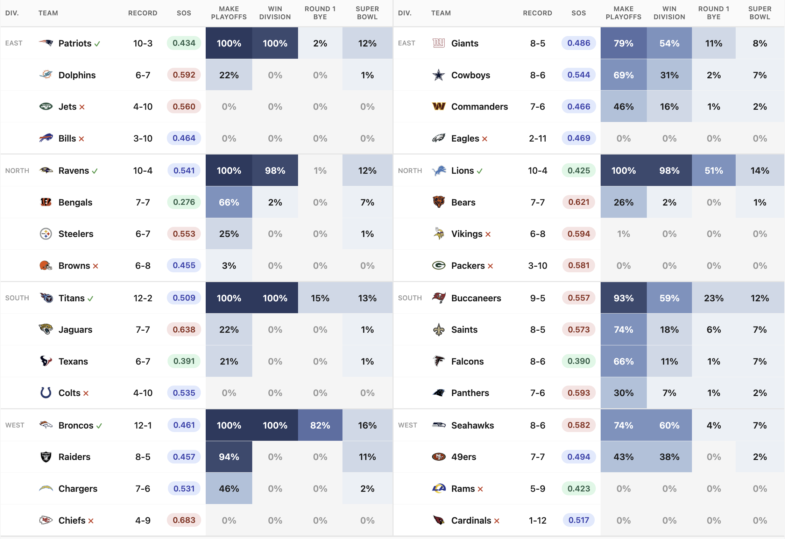
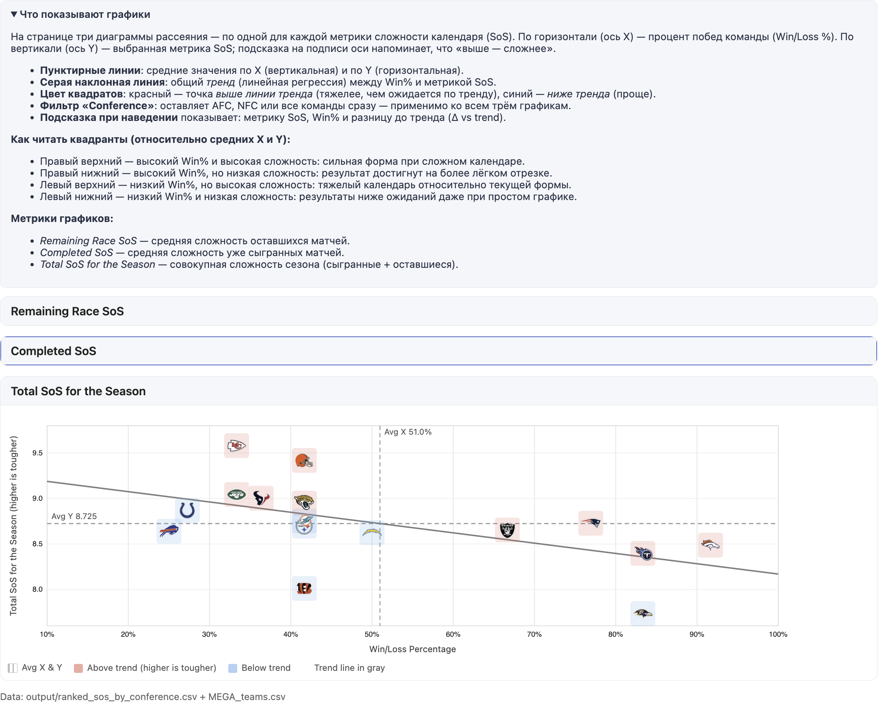
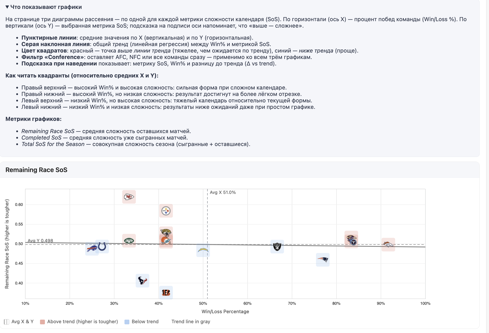
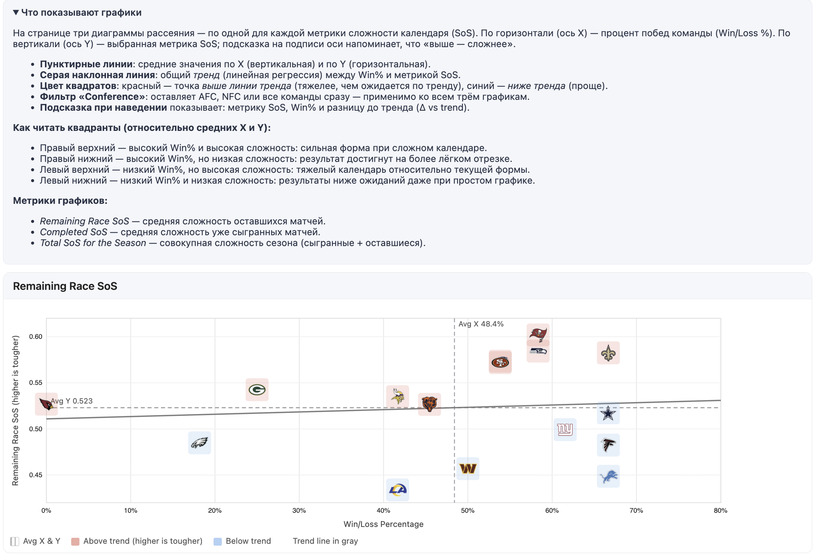

# 🏈 Analyse der Spielplanstärke (SOS): Wer ist wirklich gut und wer hat nur Glück



## 📊 Spielplanstärke (SOS): Die ganze Wahrheit über "coole" Rekorde

Also, aufgepasst, Leute. Stellt euch vor: Der eine Typ hat seinen Gegner gezwungen, das Spiel aufzugeben und so gewonnen, während der andere 10 Field Goals auf die VIP-Tribüne geschossen hat, weil der Teambesitzer davon träumt, Returner zu sein. Aus diesem Grund sind die Bilanzen der Teams wenig aussagekräftig, aber Statistiken und Rankings sind es. Auf dieser Grundlage habe ich entschieden zu untersuchen, wer dominiert und wer dominiert wird (oder: wer gut ist und wer schlecht).

Die **Ravens** stehen bei 10-2 und alle sind begeistert von ihrem Rekord. Aber Moment mal... ihr SOS der gespielten Spiele beträgt **0.43** – das ist der leichteste Spielplan in der gesamten AFC! Der Gesamtindex von **7.73** ist regelrecht lächerlich. Sie haben buchstäblich die ganze Saison gegen Kinder gespielt. Ich sage nicht, dass sie schlecht sind, aber ihr 10-2 ist stark überbewertet.

Die **Broncos** oder Valera 4 Pässe sehen mit ihrem 11-1 wie Monster aus, oder? Nun, ihr Gesamt-SOS von **8.49** ist ebenfalls einer der weichsten in der Conference. Eine schöne Zahl, aber die Gegner waren nur mittelmäßig (wie die gesamte AFC).

Die **Patriots** mit ihrem 10-3 – das ist eine ganz andere Geschichte, Freunde. Sie haben sich mit wirklich starken Teams duelliert (SOS der gespielten Spiele **0.53**), und jeder ihrer Siege kostete Schweiß und Blut. Dazu kommt ein relativ leichtes Finish (**0.46**) – sie könnten wirklich auf den 1. Seed schießen.

In der NFC gibt es eine ähnliche Bewegung.
Die **Lions** sitzen bei 8-4 mit einem Gesamt-SOS von **7.91** – das ist der absolut leichteste Weg in der Conference! Die Kätzchen haben im Sandkasten gespielt.

Die **Giants** mit 8-5 haben einen Gesamt-SOS von **9.20** und haben sich jeden Sieg redlich verdient (außer einem, der jedem klar ist).

Die **Seahawks** mit ihren 7-5 sehen ebenfalls nach einer Blase aus. SOS der gespielten Spiele **0.44** – sie haben nur gegen „Gemüse“ gespielt. Und jetzt steht ein hartes Finish bevor (**0.58**) – hier...

Die **Commanders** stehen bei 6-6 und es scheint, als wäre die Saison verloren. Aber ihr SOS der gespielten Spiele beträgt **0.56** – einer der härtesten. Sie haben gekämpft wie Löwen, nur waren die Gegner stark und der Arsch von Markus war schwach. Und jetzt kommt der Witz – sie haben einen **0.46**-Finish vor sich, den leichtesten unter allen Anwärtern! Das ist der klassische Dark Horse, der noch für Aufsehen sorgen wird, merkt euch meine Worte.

---

## 👨🏻‍🦼‍➡️ Das Playoff-Rennen der AFC: Wer kommt rein, wer bricht ein



### Top-Vier (Division-Sieger)

Die **Broncos** (11-1) kontrollieren im Moment alles. Sie haben noch 5 Spiele, das Restprogramm ist ausgewogen (SOS Zuk. 0.50). Sie wirken stabil, obwohl ich schon sagte – der Weg war einfach.

Die **Ravens** (10-2) halten alle für Favoriten, aber ich wiederhole – ihr Rekord ist aufgeblasen wie eine Blase. Sie spielten gegen die Schwächsten in der AFC (SOS gespielter Spiele 0.43!), jetzt wird es etwas schwieriger (0.52). Mal sehen, ob sie durchhalten.

Die **Titans** (10-2) – das ist eine wirklich stabile Truppe. Bei ihnen ist alles ausgewogen, weder leichte Geschenke noch wahnsinnige Herausforderungen. Durchschnittlicher SOS die ganze Saison. Sie haben ihre 10 Siege verdient.

Und die **Patriots** (10-3) – das sind meine unterschätzten Favoriten. Sie spielten gegen die stärksten Gegner (SOS 0.53), und jetzt steht ihnen ein relativ einfacher Weg bevor (0.46). Mit 10-3 und solchen Kennzahlen können sie alle überraschen und auf den ersten Seed springen.

### Kampf um die Wild Card – hier beginnt der Spaß

Die **Raiders** (8-4) sehen fast wie ein garantierter Kandidat für die erste Wild Card aus. Bei ihnen ist alles durchschnittlich – weder leichtes noch schweres Programm. Stabilität siegt.

Aber dann beginnt die Fleischwolf-Phase. Es gibt eine ganze Menge Teams mit 6-6 und 5-7, und hier entscheidet die Spielplanstärke alles.

Die **Chargers** (6-6) haben einen ziemlich einfachen Endspurt vor sich (0.48). Bei ihrer aktuellen Form können sie die zweite Wild Card tatsächlich holen, wenn Maga es endlich schafft, das Kick-Meter zu meistern.

Die **Bengals** (5-7) – das ist das Dark Horse für die Wild Card in der AFC! Sie haben einen SOS Zuk. von **0.38** vor sich – das ist der leichteste Endspurt überhaupt! Plus ein Gesamt-SOS von nur 8.01. Wenn sie jetzt die Welle erwischen, können sie alle einholen.

Die **Steelers** (5-7) stecken im Schlamassel. Ja, sie stehen bei 5-7, aber das ist nicht das Problem. Ihr SOS der gespielten Spiele war leicht (0.48), und jetzt steht ihnen einer der härtesten Endspurts bevor (0.58). Sie spielten gegen Schwächlinge, waren schlecht, entließen Rodgers und kämpften sich zurück, aber jetzt beginnt die echte Prüfung.

Die **Browns** (5-7) sind auch im Rennen, aber aus einem anderen Grund. Ihr Gesamt-SOS von **9.42** ist der schwerste unter allen Anwärtern in der AFC.

Die **Chiefs** (4-8) sind technisch gesehen noch im Rennen, besonders nach dem kämpferischen Sieg gegen Dallas in den letzten Sekunden der Overtime durch die Realisierung des 2-PT-Versuchs (PFERD!!!), aber seien wir realistisch – sie haben einen Gesamt-SOS von **9.58** plus einen schrecklichen Endspurt vor sich (0.62). Es bräuchte ein Wunder biblischen Ausmaßes.

**Das Playoff-Rennen der AFC:**


```
Team	          Bilanz  SOS Zuk.  SOS Verg.  Gesamt SOS  
Broncos *        11-1    0.50      0.50       8.49       
Ravens y         10-2    0.52      0.43       7.73       
Titans y         10-2    0.51      0.49       8.40       
Patriots y       10-3    0.46      0.53       8.73       
Raiders  x       8-4     0.49      0.52       8.65       
Chargers x       6-6     0.48      0.52       8.63       
Bengals  x       5-7     0.38      0.51       8.01       
Steelers         5-7     0.58      0.48       8.70       
Jaguars          5-7     0.53      0.53       8.95       
Browns           5-7     0.51      0.57       9.42       
Dolphins         5-7     0.51      0.52       8.75       
Texans           4-7     0.41      0.60       9.00       
Jets             4-8     0.51      0.54       9.04       
Chiefs           4-8     0.62      0.54       9.58       
```

**Legende:** \* = Erster Seed | y = Division-Sieger | x = Wild Card-Teilnehmer

---

## 🔥 NFC – hier herrscht das pure Chaos


### NFC North – Lions regieren den Ball

Die **Lions** (8-4) kontrollieren die Division, aber ich habe es schon erklärt – ihr Gesamt-SOS von 7.91 ist der leichteste in der NFC. Auch das Restprogramm ist sanft (0.45). Sie sind ein gutes Team, aber überschätzt sie nicht nur wegen des Rekords.

Die **Bears** (5-6) und **Vikings** (5-7) versuchen aufzuholen, aber beide haben ein schweres Programm (Gesamt-SOS über 9.0). Die Chancen sind gering.

### NFC South – DAS HEISSESTE RENNEN DER LIGA!

Im Ernst, Leute, das ist genial. Hier können alle 4 Teams die Division gewinnen, und die Spielplanstärke entscheidet alles.

Die **Saints** (8-4) führen momentan, aber freut euch nicht zu früh – eine Pechsträhne hat begonnen. Ihr SOS Zuk. beträgt **0.58** – das ist heftig. Sie könnten die Führung in den letzten Wochen leicht verspielen.

Die **Falcons** (8-4) stehen ebenfalls bei 8-4, aber der Witz ist: Ihr Endspurt ist viel einfacher (0.48)! Vom Spielplan her sind sie in einer besseren Position als die Saints. Der Gesamt-SOS ist auch niedriger (8.57 gegenüber 9.10). Ich würde in diesem Rennen auf sie setzen.

Die **Buccaneers** (7-5) liegen eine Niederlage zurück, aber sie haben einen **0.60**-Endspurt vor sich – ein schreckliches, das schwerste Finish in der NFC! Sie könnten nicht nur aus dem Divisionsrennen, sondern auch aus dem Wild Card-Rennen ausscheiden. Kritische Situation.

Die **Panthers** (7-6) scheinen am weitesten zurückzuliegen, aber schreibt sie nicht zu früh ab. Sie haben einen durchschnittlichen Endspurt (0.57) und einen Gesamt-SOS von 8.78 – nicht der leichteste, aber auch nicht mörderisch. Wenn die Saints und Bucs bei ihren schweren Programmen einbrechen, kann Semen den Sand aus der altersschwachen Vagina schütteln und wie ein Opa leise heranschleichen und alle überraschen. Die Division ist noch nicht entschieden!

### NFC East – Kampf der Alten

Die **Cowboys** (8-4) führen die Division mit einem durchschnittlichen Spielplan an – nichts Besonderes, einfach stabile Arbeit und etwas Glück.

Die **Giants** (8-5) liegen ein Spiel zurück, aber lasst euch von dieser Zahl nicht täuschen. Ihr Gesamt-SOS von **9.20** zeigt, dass sie wirklich ein starkes Team sind – sie spielten die ganze Saison gegen Monster. Jeder Sieg wurde mit Schweiß, Blut und dem brennenden Arsch des Gegners errungen. In der letzten Woche könnten die Giants und Cowboys über das Divisionsergebnis oder sogar den ersten Seed entscheiden.

Die **Commanders** (6-6) – noch ein Dark Horse! Sie sind durch den harten Start (SOS 0.56) ausgelaugt, aber vor ihnen liegt der leichteste Endspurt (0.46). Klassisches Szenario für den Durchbruch – die schwere Prüfung liegt hinter ihnen, der einfache Weg liegt vor ihnen.

### NFC West – unklare Lage

Im Westen herrscht ein seltsames Chaos, Leute.

Die **Seahawks** (7-5) führen, aber ich sagte ja schon – ihr Rekord ist überbewertet (leichtes Programm in der Vergangenheit 0.44, harter Endspurt 0.58). Sie spielten gegen "Gemüse", jetzt beginnt der Fleischwolf. Mal sehen, was sie wirklich draufhaben.

Die **49ers** (7-6) sind in einer ähnlichen Situation – auch leichte Vergangenheit (0.46), auch harter Endspurt (0.57). Die Blase kann jederzeit platzen, besonders wenn Kirill wieder einmal zur Unzeit das Spiel verlässt und am Kick-Meter scheitert.

Die **Rams** (5-7) liegen anscheinend weit zurück, aber nach einem schweren Start (0.59) haben sie einen leichten Endspurt vor sich (0.43) – sie könnten nach vorne preschen und Chaos in der Division stiften.

### Wild Card in der NFC – wer kommt rein?

Die **Giants** (8-5) oder **Cowboys** (8-4) sehen fast wie eine garantierte Wild Card aus.

Weiter geht es mit einem harten Kampf zwischen den **Buccaneers, Seahawks, 49ers, Panthers** (alle 7-5 oder 7-6) und dem Dark Horse **Commanders** (6-6).

Die Bucs sind aufgrund ihres harten Endspurts stark gefährdet. Seahawks und 49ers sind überbewertet. Die Commanders mit ihrem leichten Endspurt könnten alle überraschen. Das wird eine Show!

**Das Playoff-Rennen der NFC:**


```
Team	          Bilanz  SOS Zuk.  SOS Verg.  Gesamt SOS  
Lions   y        8-4     0.45      0.47       7.91
Saints  x        8-4     0.58      0.52       9.10
Falcons *        8-4     0.48      0.51       8.57
Cowboys x        8-4     0.52      0.47       8.26
Giants  y        8-5     0.50      0.55       9.20
Buccaneers       7-5     0.60      0.52       9.29
Seahawks  x      7-5     0.58      0.44       8.19
49ers   y        7-6     0.57      0.46       8.27
Panthers         7-6     0.57      0.50       8.78
Commanders       6-6     0.46      0.56       9.01
Bears            5-6     0.53      0.55       9.17
Vikings          5-7     0.54      0.54       9.12
Rams             5-7     0.43      0.59       9.19
```
**Legende:** \* = Erster Seed | y = Division-Sieger | x = Wild Card-Teilnehmer

---

So sieht's aus, Kinder, in der AFC erwartet uns wahrscheinlich Langeweile, aber in der NFC ein echtes, absolutes Kino, in dem jeder Teilnehmer am Rennen die Playoffs verpassen kann. Es bleiben noch 5 Wochen, und der Kampf wird bis zum Schluss gehen!